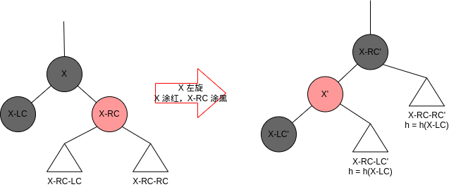
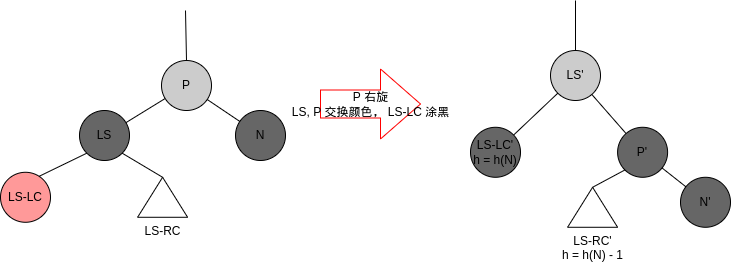
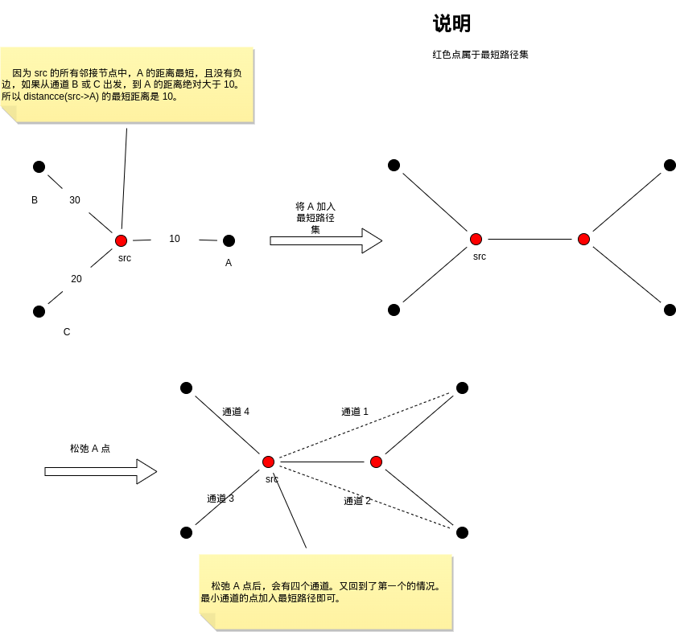
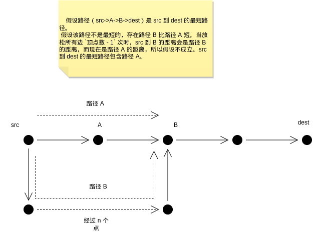
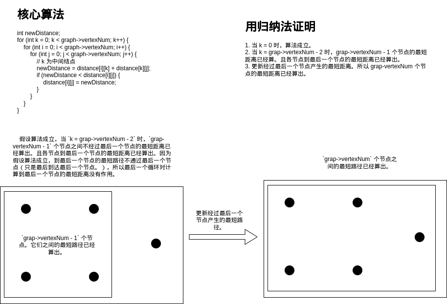
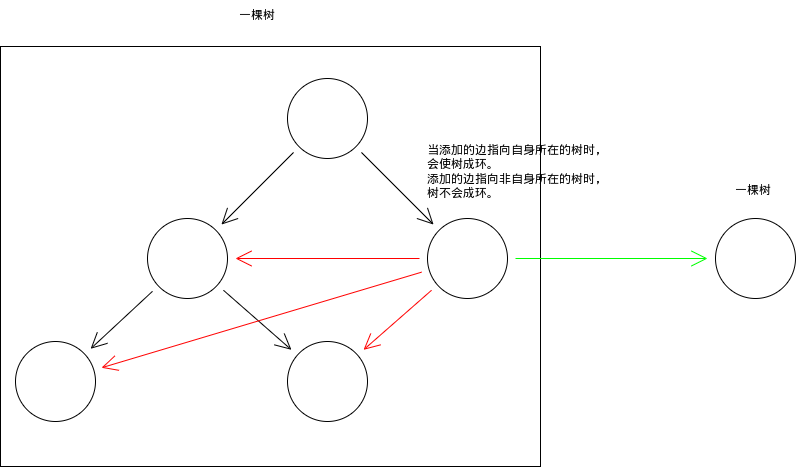

# Data Structrues

## Content

[toc]

## References

-   《数据结构与算法分析：C 语言描述》

## 时间复杂度

### References

-   <https://www.bigocheatsheet.com/>
-   <https://mp.weixin.qq.com/s/VQN5pQAAwi3Zwn-vcsu-3w>

### 常见的公式

等差数列之和:

$$
a_{n} = a_{1} + (n - 1)d \\
S_{n} = na_{1} + \frac{1}{2}n(n-1)d
$$

等比数列之和:

$$
a_{n} = a_{1}q^{n - 1} \\
S_{n} = \frac{a_{1}(1 - q^{n})}{1 - q}, \quad (q \neq 1)
$$

n 次方数列之和:

$$
a_{n} = n^{2} \\
S_{n} = \frac{1}{6}n(n + 1)(2n + 1)
$$

<br>

$$
a_{n} = n^{3} \\
S_{n} = (\frac{n(n + 1)}{2})^{2}
$$

Others:

$$
O(\log n!) = O(\log n^{n}) = O(n \log n) \\
堆的插入与删除：O(\frac{\log n!}{n}) = O(\frac{\log n^{n}}{n}) = O(\log n)
$$

### 分治算法的时间复杂度

方程 $T(N) = aT(N / b) + \Theta(N^{k})$ 的解为

$$
T(N) =
\begin{cases}
O(N^{\log_{b} a}), & a > b^{k} \\
O(N^{k}\log N), & a = b^{k} \\
O(N^{k}), & a < b^{k} \\
\end{cases}
$$

其中 $a \geq 1, b > 1$。

常见的情况

-   $O(N^{0}\log N) = O(\log N), a = 1, b = 2, k = 0$

    二叉搜索树、AVL 树、红黑树、伸展树、B 树的搜索、插入和删除的平均时间复杂度。

-   $O(N^{\log_{2} 2}) = O(N), a = 2, b = 2, k = 0$

    二叉搜索树的搜索、插入和删除的最差时间复杂度。

-   $O(N^{1}) = O(N), a = 1, b = 2, k = 1$

    基于快速排序的选择方法. See [ref](https://leetcode.cn/problems/kth-largest-element-in-an-array/description/?envType=study-plan-v2&envId=selected-coding-interview).

-   $O(N^{1}\log N) = O(N\log N), a = 2, b = 2, k = 1$

    快速排序、归并排序的平均时间复杂度

### Others

希尔排序的计算比较复杂。至于最坏情形的时间复杂度，[有的资料](https://www.bigocheatsheet.com/)说是 $(N\log (N))^{2}$，而《数据结构与算法分析：C 语言描述》说是 $N^{2}$。

堆排序的平均时间复杂度是，$\log_{2} N + \log_{2} (N - 1), + \cdots + log_{2} 1 = \Theta(\log_{2} (N!)) = O(N\log N)$。

二叉堆的建堆的时间复杂度是，$O(N)$。

## 排序算法

[source code](../data_structures/sorting)

### Insertion Sort

### Selection Sort

### Bubble Sort

### Merge Sort（归并排序）

### Quick Sort（快速排序）

### Shell Sort（希尔排序）

### Heap Sort（堆排序）

[构建堆的时间成本](https://www.hello-algo.com/chapter_heap/build_heap/#823)

### External Sort（外部排序）

[ref](https://www.cnblogs.com/qianye/archive/2012/11/25/2787923.html)

#### 用胜者树合并的外部排序

胜者树

> 规律：树或子树的根节点是整棵树的最小的数。
>
> 左子树与右子树的胜者（小者胜）比较，胜者放入父节点。

#### 用败者树合并的外部排序

败者树

> 规律：树或子树的根节点是整棵树的第二小的数。
>
> 左子树与右子树的胜者（小者胜）比较，败者放入父节点。

败者树比胜者树好之处：

> 对于胜者树来说，整棵树的胜者是存在于每一层的节点中的，而对于败者树，整棵树的胜者只存在于树的叶子层。所以更新树时，败者树的更新会比胜者树少。

### Counting Sort（计数排序）

ref: [一文弄懂计数排序算法！](https://www.cnblogs.com/xiaochuan94/p/11198610.html)

建立一个比较大的数组 array，将数 N 放入 array[N - min]。

### Bucket Sort（桶排序）

将一定范围的数放入桶内，然后将桶内的数排序，再将数从桶内拿出。

### Radix Sort（基数排序）

建立 10 个桶，每个桶分别对应权位是 0，1，2，... 9 的数。判断每个数的权位，然后将数放在对应的桶。

## List

[source code](../data_structures/linked_list)

### Linked List

#### Single Linked List

#### Double Linked List

#### Circular Linked List

## Tree

[source code](../data_structures/tree)

### BinSearchTree（二叉查找树）

### AVL Tree（自平衡二叉查找树）

### Splay Tree（伸展树）

[伸展树的定义](https://zh.wikipedia.org/wiki/%E4%BC%B8%E5%B1%95%E6%A0%91)

> 在每次查找之后对树进行调整，把被查找的条目搬移到离树根近一些的地方。伸展树应运而生。伸展树是一种自调整形式的二叉查找树，它会沿着从某个节点到树根之间的路径，通过一系列的旋转把这个节点搬移到树根去。

### BTree（多路搜索树）

`B` 是 balance 的简称。

#### References

-   [Introduction of B-Tree](https://www.geeksforgeeks.org/introduction-of-b-tree-2/)
-   [Insert Operation in B-Tree](https://www.geeksforgeeks.org/insert-operation-in-b-tree/)
-   [Delete Operation in B-Tree](https://www.geeksforgeeks.org/delete-operation-in-b-tree/)
-   [Difference between B tree and B+ tree](https://www.geeksforgeeks.org/difference-between-b-tree-and-b-tree/)

#### Btree 性质

[两种流行的定义](https://stackoverflow.com/a/45826413)
[多种定义](https://www.zhihu.com/question/19836260)
[wiki](https://en.wikipedia.org/wiki/B-tree#Definition)

> 一个用阶来描述 `min <= children <= max` 而另一个用最小度数。<br>
> 它们的区别是，`CLRS Degree (Degree)` 对应的阶只能是偶数。

*internal node（内部节点）：非叶子节点。*

##### Knuth's Definition

设 Btree 的阶（Order）为 M。

叶子节点：指向叶子节点的指针为 NULL。

1. 树中每一个节点至多有 M 棵子树；
2. 若根节点不是叶子节点，则至少有两棵子树；
3. 除根节点之外的所有非终端节点（内部节点）至少有 `ceil(M/2)` 棵子树；
4. 左儿子的 key < key < 右儿子的 key。
5. 所有的叶子节点都出现在同一层次上，并且不带信息。

##### CLRS（算法导论）

*对 Knuth 的改进。*

设 BTree 的最小度数（minimum Degree）为 t (t >= 2)。

叶子节点：指向儿子的指针都为 NULL 的节点。

1. 每个节点（除了 root）有 [t - 1, 2t - 1] 个 keys；
2. 每个内部节点（除了根节点）有 [t, 2t] 个儿子。
3. 当 BTree 不为空时，根节点至少有 1 个 key。至多有 2t 儿子。
4. 左儿子的 key <= key <= 右儿子的 key。
5. 所有的叶子节点都有同样的深度，与树的高度相同。

#### 操作

如何保持叶子节点在同一深度:<br>
> 插入满时，分裂。 删除时，key < t 时，合并。所以不会造成左右儿子深度不一。

##### 三个基本的操作

-   分裂

    如果本节点不满而有一个儿子满时，可分裂儿子。将儿子的 keys[t - 1] 拿出，则儿子刚好平分。将儿子的 keys[t - 1] 插入到本节点的左边，再将儿子的右半部分作为 keys[t - 1] 的右儿子即可。本节点的 keyCount 加 1。分裂后，本节点增加一个 key 和 child，被分裂的儿子少一个 key，child 数量不变。

-   合并

    如果本节点 keyCount >= t 且 keys[idx] 的左右儿子的 keyCount = t - 1 时，可将 keys[idx] 及其左右儿子合并为一个满的节点。合并后，本节点少一个 key 和 child。被合并的两个儿子一共多一个 key，child 数量不变。

-   向兄弟借一个 key 和 child

    如果兄弟的 keyCount >= t 可向兄弟一个 key 和一个儿子。

    分为两个情况：

    -   借左兄弟的最右的key 和儿子。
    -   借右兄弟的最左的key 和儿子。

##### 插入的递归操作

插入时，总是向根节点的 BTree 插入 key（这样 btree 的 key 的左右儿子的高度相同。）。比如：`btreeInsert(key, root)`。

1.  当根节不满时，插入总是成功。
2.  当根节点满时，则分裂根节点。然后更新新的根节点。再然后向根节点的 BTree 插入 key，这样就回到了第一步。

先定义一个函数 `void btreeNodeInsertNonFull(Key key, BTreeNode btreeNode)`，它的功能是向 btreeNode 的 Btree 插入 key。前提是，btreeNode 不满。结合 `btreeInsert` 就可完成插入操作了。

`void btreeNodeInsertNonFull(Key key, BTreeNode btreeNode)` 的实现

1.  如果本节点是叶子节点，则直接插入。
2.  如果本节点不是叶子节点，则向儿子节点插入。

    1.  如果儿子节点满，则分裂儿子节点

3.  重复第二步。

*最终是向叶子节点插入。因为直接向非叶子节点插入 key 时，会多一个 child。*

##### 删除的递归操作：

删除时，总是向根节点的 BTree 删除 key（这样 btree 的 key 的左右儿子的高度相同。）。比如：`btreeDelete(key, root)`。

1.  当根节点的 `keyCount >= 1` 时，删除总是成功。

定义一个函数 `void btreeNodeDelete(Key key, BTreeNode btreeNode)`, 它的功能从 btreeNode 的 BTree 中删除 key。它的前提是，btreeNode 的 keyCount 比允许的最少值至少多 1（根节点最少可有 0 个 key, 非根节点最少有 `t - 1` 个 key）。

1.  当 key 在本节点时

    1.  如果本节点是叶子节点时，则直接删除。
    2.  否则。当儿子节点的 keyCount 不是允许的最少值时，将儿子的 key 覆盖要删除的 key, 然后从儿子的 Btree 中删除该 key。
    3.  否则。合并两个儿子，再从合并的儿子删除 key。

2.  当 key 不在本节点时

    1.  如果儿子的 keyCount 是允许的最小值，则填充儿子（儿子先向其兄弟借，如果兄弟没得借则与兄弟合并）。
    2.  否则。从儿子的 BTree 中删除 key。

*最终是向叶子节点删除。因为直接删除非叶子节点的 key 时，会少一个 child。*

#### 说明

以下的例子是 CLRS（算法导论）的 BTree

1. 叶子节点的 childs 不初始化为 NULL。
2. 左儿子的 key <= key <= 右儿子的 key。

[source code](../data_structures/tree/btree.h)

### Huffman Tree（哈夫曼树）

#### refer:

-   <https://www.geeksforgeeks.org/huffman-coding-greedy-algo-3/>

#### 说明

构造 huffman 树的步骤：

> 建立一个堆，其节点是一个一棵树。初始时，用每个数建立一棵树，所以每棵树只有一个节点，然后将每个棵的插入堆中。<br>
> 在堆中弹出两个最小频率的根节点的树，合并两棵树，并产生一个新的根节点，然后将合并后的树的根节点插入堆中。直到堆中只有一个堆节点。剩下的堆节点就是 huffman tree。

### Red-black tree

#### References

-   [彻底理解红黑树](https://www.jianshu.com/p/a9c064d38a92)
-   [Red-Black Tree | Set 3 (Delete)](https://www.geeksforgeeks.org/red-black-tree-set-3-delete-2/?ref=rp)
-   [Red–black tree](https://en.wikipedia.org/wiki/Red%E2%80%93black_tree)

#### 红黑树的定义

ref: [红黑树](https://zh.wikipedia.org/zh-hans/%E7%BA%A2%E9%BB%91%E6%A0%91)

红黑树是每个节点都带有颜色属性的二叉搜索树，颜色为红色或黑色。在二叉搜索树强制一般要求以外，对于任何有效的红黑树我们增加了如下的额外要求：

1.  节点是红色或黑色。
2.  根是黑色。
3.  所有叶子都是黑色（叶子是NIL节点）。
4.  每个红色节点必须有两个黑色的子节点。（从每个叶子到根的所有路径上不能有两个连续的红色节点。）
5.  从任一节点到其每个叶子的所有简单路径都包含相同数目的黑色节点。

总结:

> 如果父节点是红色则其两个儿子一定是黑色。因此，不能有连续的两个红色节点。<br>
> 如果父节点是黑色则其儿子的颜色可能任意色。比如：红红，黑黑，红黑。

#### 二叉搜索树与红黑树的插入与删除

红黑树的插入与删除与二叉搜索树一样，不过是多了平衡调整。

#### 定义

*为了方便描述，有了这些定义*

1.  Nil（NULL）节点为黑色节点
2.  当前平衡点 N, N 的兄弟 S, SL, SR 为 S 的左右树。P 为 N 的父节点，GP 为祖父节点。
3.  h(A -> B -> Nil): 为路径 A -> B -> Nil 的黑色节点数量。
4.  h(树)：表示 h(root -> Nil)。
5.  D 为删除的节点。

红黑子树的定义

> 比红黑树的定义差不多，只是根节点的颜色可以是任意的。

如果一棵树的节点都是红黑子树，且根节点为黑色，则这棵树是红黑树。

#### 红黑树的常用的旋转操作

*旋转能使树保持二叉搜索树的特性。*

1.  以下的旋转和变换颜色不仅可以让红黑树保持二叉搜索树的特性，还可保持红黑树的特性:

    -   
    -   条件：当 X（B）, X-LC（B）, X-RC（R）时。
    -   操作：将 X 左旋。之后将 X 涂红，X-RC 涂黑（或者 X 与 X-RC 互换颜色）。
    -   分析：

        1.  X-RC 子树的父节点不会由从黑变红。这样就不会出现父红子红的情况。
        2.  因为 `h(X-RC) = h(X-LC)`，所以 X-RC', X' 子树是红黑子树。因为 X-LC' 子树没改变过，所以也是红黑子树。
        3.  X 子树的根节点的颜色与 X-RC' 子树的根节点的相同。`h(XR') = h(X)`。

2.  以下的旋转和变换颜色使 N' 的兄弟子树的 h 减 1:

    -   
    -   条件：当 N（右；B）, P, LS（B）, LS-LC（R）。
    -   操作：P 右旋，P 和 LS 交换颜色，LS-LC 变黑。
    -   分析：

        1.  LS-RC 子树的父节点不会由黑变红。
        2.  因为 `h(LS-RC 子树) = h(N) - 1`，所以删除 N 后，P', LS' 子树是一棵红黑子树。
        3.  P' 子树的根节点的颜色与 LS' 子树的根节点的相同。`h(LS') = h(P)`

#### 红黑树的插入

新插入的节点都是红色的

> 因为红色节点不会破坏树（包含所有子树）的平衡（从任一节点到其每个叶子的所有简单路径都包含相同数目的黑色节点），而插入黑色节点会破坏树（包含所有子树）的平衡。遇到“红红节点”的情况时，只是局部（一部分子树）调整即可。
>
> 插入节点与其父节点为红色时，才要调整红黑树。

[情形3. 父红-叔红](https://www.jianshu.com/p/96e652ccf720)根节点是否会变为红色？

> 递归时，当 N 为根节点时会调用“情形1. N为根节点（父节点为NULL）”的调整方法。所以会将根节点涂黑。


#### 红黑树的删除

和平衡二叉搜索树一样，删除的节点一定子树中，最大或最小的一个节点是一个叶子节点。所以该节点最多只有一个儿子。<br>
只有一个子节点时，删除节点只能是黑色，其子节点为红色，否则无法满足红黑树的性质了。反之，删除的节点是红色时，则该节点一定是一个叶子节点。

1.  如果删除的节点是红色的，则直接删除即可，因为补上的节点（Nil）黑色的。
2.  如果删除的节点是黑色时，才需要平衡调整。

    1.  当删除的节点有一个儿子时，则儿子一定是红色的，所以将补上的红色儿子涂黑即可达到平衡。
    2.  当删除的节点是一个叶子节点时，补上的节点是一个 Nil 节点。这时树就不平衡了，所以补上的节点成为当前平衡点（N）。

[source code](../data_structures/tree/red_black_tree/red_black_tree.h)

## Heap

[source code](../data_structures/heap)

### Binary Heap（二叉堆）

### Leftist Heap（左式堆）

#### 说明

零路径长 Npl(X) 的定义：

> 从 X 到一个没有两个儿子的节点的最短路径的长度。
>
> 有 0 或 1 个儿子的节点的零路径长为 0。`Npl(NULL) = -1`。

左式堆：对于堆中的每一个节点，其左儿子的零路径长至少与右儿子的零路径长一样大（`leftistHeap->Npl >= leftistHeap->Right->Npl `）。具有堆的性质。

两个左式堆合并的操作：较小的堆顶的堆的右子树与另一个堆合并。如果合并之后的树的右子树比左子树大，则交换两个子树，否则不交换。

插入：即两个堆合并

删除Min：即一个堆的左右子树合并

合并、插入和删除 Min 的平均复杂度是 $O(log N)$。

### Skew Heap（斜堆）

对左式堆的改进，没有零和路径长的信息。如果两个堆非空，则合并两个堆之后，无条件交换其左右儿子。

合并、插入和删除 Min 的平均复杂度是 $O(log N)$。

### Binomial Queue（二项队列）

#### 说明

二项队列，属于一种构建极为精妙的堆。它不仅具有左式堆的优点（$O(\log N)$时间复杂度内实现堆合并），同时具有二叉堆的优点（$O(N)$时间复杂度内实现建堆）。

二项队列由多个二项树组成

二项树的上一层小于等于下一层。即父节点小于等于其所有后裔。二项树的节点数：$B_{0} = 1， B_{1} = 2, B_{3} = 4, ... , B_{n} = 2^{n}$。$B_{n}$ 的结构是在 $B_{n-1}$ 的根节点插入 $B_{n-1}$。

插入和删除都用合并实现。

插入和删除需要用到的小二项树:

-   插入时

    $$
    \begin{aligned}
    B_{n}   & = B_{n - 1} + B_{n - 2} \cdot 2 \\
            & ... \\
            & = B_{n - 1} + B_{n - 2} + \cdots + B_{0} \cdot 2 \\
            & = B_{n - 1} + B_{n - 2} + \cdots + B_{0} + 1 \\
    \end{aligned}
    $$

    插入操作：创建一个空二项队列, 然后插入要插入的节点。之后，将这个二项队列与原来的合并。

-   删除时

    $$
    B_{n} - 1 = B_{n - 1} + B_{n - 2} + \cdots + B_{0}
    $$

    删除 Min 操作：找出最小的二项树，然后删除其根节点。之后将删除后产生的二项树放下一个空的二项队列。最后将此二项队列与原来的合并。

## Hash Table

[source code](../data_structures/hash_table)

### SeparateChaining

解决冲突的方法是分离链接法，是将散列到同一值的所有元素保留到一个链表中。

### OpenAddressing

解决冲突的方法是开放定址法。有一个冲突解决方程 `f(冲突次数)`，`将要插入的位置 = (散列值 + f(冲突次数)) mod TableSize`。

## Stack, Queue

[source code](../data_structures/stack_queue)

### Stack

#### 用数组实现

#### 用链表实现

### Queue

#### 用数组实现

#### 用链表实现

## 图

[source code](../data_structures/graph)

### 概念

    graph, digraph: 无向图，有向图
    arc, edge: 弧（有向图的“边”）, 边（无向图的边）。
    vertex: 点
    adj: adjacent. 邻接。
    matrix: 矩阵
    weight, unweight: 有权的, 无权的
    directed, undirected: ...

    the single-source shortest paths: 单源最短路径
    the all-pairs shortest paths: 多源最短路径
    Acyclic Graph: 无环图
    Minimum Spanning Tree（mst）: 最小生成树

### 图的存储方式

ref: [图的顺序存储结构及C语言实现](http://data.biancheng.net/view/37.html)

> ArcNode: 弧节点
> VNode: Vertex Node. 顶点节点。

ref: [邻接表、邻接多重表、十字链表及C语言实现](http://data.biancheng.net/view/38.html)

> 在实际应用中，图最常用的是链式存储结构。

#### 邻接矩阵

```c
typedef struct EdgeStruct Edge;

typedef struct GraphStruct {
    int** edges;
    int vertexNum;
} *Graph;

struct EdgeStruct {
    int src, dest, weight;
};

void graphAddDirectedEdge(Edge edge, Graph graph) {
    graph->edges[edge.src][edge.dest] = edge.weight;
}

void graphAddUndirectedEdge(Edge edge, Graph graph) {
    graph->edges[edge.src][edge.dest] = edge.weight;
    graph->edges[edge.dest][edge.src] = edge.weight;
}
```

#### 邻接表

```c
typedef struct AdjNodeStruct* AdjList;

typedef struct EdgeStruct Edge;

typedef struct GraphStruct {
    int vertexNum;
    AdjList* adjLists;
} *Graph;

typedef struct AdjNodeStruct {
    int dest;
    int weight;
    struct AdjNodeStruct* next;
} *AdjNode;

typedef struct EdgeStruct {
    int src, dest;
    int weight;
} Edge;

void graphAddDirectedEdge(Edge edge, Graph graph) {
    AdjNode newNode = adjNodeCreate(edge.dest, edge.weight);
    // ### 将 newNode 插入到表头
    newNode->next = graph->adjLists[edge.src];
    graph->adjLists[edge.src] = newNode;
}

void graphAddUndirectedEdge(Edge edge, Graph graph) {
    // ### 添加 `src -> dest`
    AdjNode newNode = adjNodeCreate(edge.dest, edge.weight);
    // 将 `src -> dest` 插入到表头
    newNode->next = graph->adjLists[edge.src];
    graph->adjLists[edge.src] = newNode;

    // ### 添加 `dest -> src`
    AdjNode newNode2 = adjNodeCreate(edge.src, edge.weight);
    newNode2->next = graph->adjLists[edge.dest];
    graph->adjLists[edge.dest] = newNode2;
}
```

#### 边集

有些无向图的算法只需求用到边集，而不需要用到点集，所以只存储边集即可。比如：bellman ford, Kruskal。

```c
typedef struct EdgeStruct Edge;

typedef struct GraphStruct {
    int vertexNum;
    int edgeNum;
    Edge* edges;
} *Graph;

struct EdgeStruct {
    int src, dest, weight;
};

void graphAddEdge(Edge edge, Graph graph) {
    static int edgeIndex;
    graph->edges[edgeIndex++] = edge;
}
```

#### 链式前向星

为了防止使用指针，用数组建立链表，类似于拉链法。实质上是邻接表。

[链式前向星的发明者是谁？](https://www.zhihu.com/question/306076815)

[链式前向星](https://baike.baidu.com/item/%E9%93%BE%E5%BC%8F%E5%89%8D%E5%90%91%E6%98%9F/5970605)

> 如果说邻接表是不好写但效率好，邻接矩阵是好写但效率低的话，前向星就是一个相对中庸的数据结构。前向星固然好些，但效率并不高。而在优化为链式前向星后，效率也得到了较大的提升。虽然说，世界上对链式前向星的使用并不是很广泛，但在不愿意写复杂的邻接表的情况下，链式前向星也是一个很优秀的数据结构。

```c
#define V (10)

struct Edge {
    int to;     // 这条边的终点
    int w;      // 权值
    // 注意：这里不是下一条边的指针。类似拉链法。
    int next;   // 下一条边的存储下标(默认0)
};

struct Edge e[100];

// head[i]存以i为起点的第一条边(在edge中的下标)
int head[V];

// cnt为边的计数，从1开始计
int cnt = 1;

void addEdge(int u, int v, int w) {
    e[cnt].to = v;
    e[cnt].w = w;
    // 插入链表头
    e[cnt].next = head[u];
    // 更新链表头
    head[u] = cnt;
    cnt++;
}
```

### 边和点的松弛

松弛的定义

> 松弛这个术语来自于用一根橡皮筋沿着连接两个顶点的路径紧紧展开的比喻放松一条边就类似于将橡皮筋转移到一条更短的路径上，从而缓解了橡皮筋的压力。

#### 边的松弛

比如：Bellman-Ford。

```c
void relex(Edge e) {
    if (distance[e.src] + e.weight < distance[e.dest]) {
        distance[e.dest] = distance[e.src] + e.weight;
    }
}
```

#### 点的松弛

比如：Dijkstra。

```c
// 松弛 src->src的邻接节点 的所有边。即松弛 src 这个点。
void relax(int src, Graph graph) {
    for (src 的邻接节点 dest) {
        if (distance[src] + `src->dest 的 weight` < distance[dest]) {
            distance[dest] = distance[src] + weight;
        }
    }
}
```

### 图的算法

#### 广度优先搜索

ref: [Breadth First Search or BFS for a Graph](https://www.geeksforgeeks.org/breadth-first-search-or-bfs-for-a-graph/)

广度优先搜索（遍历图）

> 访问自身向再依次访问完所有没有被访问过的邻接节点。

伪代码

```
void bfs(int src) {
    访问 src 节点，将其加入队列
    while (队列不为空) {
        从队列中弹出节点 v
        for (v 的所有没有被访问过的邻接节点 dest) {
            访问 dest，并将其加入队列
        }
    }
}
```

#### 深度优先搜索

ref: [Depth First Search or DFS for a Graph](https://www.geeksforgeeks.org/depth-first-search-or-dfs-for-a-graph/)

深度优先搜索（遍历图）

> 访问自身 src 向再访问其中一个没有被访问过的邻接节点。<br>
> 当一个点没有可访问的邻接节点时，则返回上一步（弹出函数栈帧），访问下一个没有被访问过节点。直到自身 src 和邻接节点都被深度优先搜索的方式访问。

伪代码

```
// 函数功能：用深度优先搜索的访问访问 src 节点。
void dfs(int src) {
    访问 src 节点
    for (src 的所有邻接节点 v) {
        v 没有被访问过
        dfs(v)
    }
}
```

#### 拓扑排序

ref: [Topological Sorting](https://www.geeksforgeeks.org/topological-sorting/)

当有向图无环时，则图一定存在拓扑排序。

定义

> 当一个的图的拓扑排序是 v1, v2, v3, .... 时，前面的点到后面的点一定存在路径，而后面的点到前面的点是没有路径的。

有两种方法

-   [将入度为 0 的点取出，移除其出度的边，之后的图会存在一个入度为 0 的点。重复该步骤即可。](https://www.jianshu.com/p/3347f54a3187)<br>

-   [反之亦可。拓扑排序最后一个点的出度一定为 0，取出该点并移除其出度的边。重复该步骤即可。这个可与深度优先搜索结合。](https://www.geeksforgeeks.org/topological-sorting/)

归缪法(反证法的一种): 如果 v1, v2, v3, .... 的路径中，存在一条从 v(i) 到 v(i-1) 的点, 当算法处理到 v(i) 时, v(i) 的出度不会是 0。所以矛盾。即证。

#### 检测图是否有环或有负值环

##### 无向图的检测环的方法

ref

-   [Detect cycle in an undirected graph](https://www.geeksforgeeks.org/detect-cycle-undirected-graph/?ref=leftbar-rightbar)
-   [kruskal 算法检测环的方法](https://www.geeksforgeeks.org/union-find/)

首先无向图的两个点只能有一条边，所以只有两个点是构成不成环的。<br>
使用深度优先搜索的方法。当当前节点 u 的一个邻接节点 v 已经访问过且 v 不是 u 的 parent 时，则图有环。<br>
分析：u 的 parent 和 v 之间会存在一个不经过 u 的路径，且 v 是先被访问，再到 parent 的。

使用深度优先搜索的方法。当当前节点 u 的一个邻接节点 v 已经访问过且 v 不是 u 的 parent 时，则图有环。

证明: 当使用深度优先搜索的访问过的节点和边还是一棵树 (T) 时, 当当前节点 u 的一个邻接节点 v 已经访问过且 v 不是 u 的 parent 时，则图有环。很明显, T 添加一条指向自己节点的边, 所以 T 存在一个环了。

##### 有向图的检测环的方法

ref: [Detect Cycle in a Directed Graph](https://www.geeksforgeeks.org/?p=18516)

首先无向图的两个点可以有一条边，所以只有两个点是可以构成环的。用无向图检测环的方法是行不通的。<br>
还是可以使用深度优先搜索的方法。当一个图存在一个环时，用深度优先搜索的方法时，当环的点没有被访问完时，则已访问的点会存在于栈（函数调用栈）中。当当前节点 u 的邻接节点 v 在栈中（在栈中则一定被访问过了）时，则图有环。

深度优先搜索的路径: 相当于函数调用栈记录的节点顺序。

如果当前节点 u 的一个邻接节点 v 已经在深度优先搜索的路径中时，那么该路径就是一个环。

间接证明法(反证法的一种): 当不存在一个环时, 当前节点 u 的一个邻接节点 v 不会出现在深度优先搜索的路径中。这个命题显然是正确的。根据逆否命题的同真同假, 所以已证。

##### 有/无向图检测负环

-   Bellman Ford. [Detect a negative cycle in a Graph | (Bellman Ford)](https://www.geeksforgeeks.org/detect-negative-cycle-graph-bellman-ford/)

    计算出源点到其他点的最短距离后，再松弛所有边一次，如果出现更短的距离后，则表示有负环。

-   Floyd Warshall. [Detecting negative cycle using Floyd Warshall](https://www.geeksforgeeks.org/detecting-negative-cycle-using-floyd-warshall/)

    计算出点之间的最短距离后，再检测所有点到自身的距离，如果出现负数的距离，则表示有负环。

Bellman-Ford 与 Floyd-Warshall 检测负环的区别

> 因为 Bellman–Ford 是单源的，而 Floyd-Warshall 是多源的，所以 Bellman-Ford 只能检测从源点出发是否存在负环，而 Floyd-Warshll 则可以检测从所有点出发，是否存在负环。

#### 最短路径算法

##### Dijkstra

ref: [Dijkstra’s shortest path algorithm | Greedy Algo-7](https://www.geeksforgeeks.org/dijkstras-shortest-path-algorithm-greedy-algo-7/)

用于计算正权边（没有无负值圈）的有/无向图的单源最短路径。将无向边当成两条有向边即可。

dijkstra算法为什么不能有负边？

> 因为Dijkstra算法在计算最短路径时，不会因为负边的出现而更新已经在最短路径的顶点的距离。

Dijkstra 的思路

1.  将顶点分成两类，一类是已经知道源点到该顶点的最短路径，其他的顶点则为另一类。将第一类顶点加入最短路径顶点集。
2.  找出非最短路径顶点集中距离最小的点 v，然后将该顶点加入最短路径集。再然后松弛 v 邻接节点的最短距离。
3.  重复上一步，直到将所有顶点加入最短路径集。



##### Bellman-Ford

ref: [Bellman–Ford Algorithm | DP-23](https://www.geeksforgeeks.org/bellman-ford-algorithm-dp-23/)

ref: [最短路径之Bellman-Ford算法](https://blog.csdn.net/Africa_South/article/details/90299584)

Bellman-Ford 算法用于计算有权边的有/无向图的单源最短路径。图中边的权重可为负数即负权边，但不可以出现负权环。

*与 Dijkstra 相比的优点是，也适合存在负权的图。*

Bellman-Ford 的思路

1.  源节点到自身的距离为 0。
2.  松弛所有边 `顶点数 - 1` 次，则到其他节点的距离就是最短距离。
3.  再松弛所有边一次。如果还有更短的距离，则图存在负环。

为什么松弛 `顶点数 - 1` 次时，到其他节点的距离就是最短距离？

> 任意选一条源点到其他节点的最短路径，因为不存在负环，所以该路径不会成环，所以只能是一条线。该最短路径最多是包含所有点。<br>
> 所以每松弛一次所有边（松弛的顺序是任意的），至少会计算出路径上一个点的最短距离。源点的最短距离已知，算出 `顶点数 - 1` 个顶点的最短距离即可。



##### Floyd-Warshall

ref: [Floyd Warshall Algorithm | DP-16。该程序没有检测负环。](https://www.geeksforgeeks.org/floyd-warshall-algorithm-dp-16/)

ref: [Floyd-Warshall算法](https://zh.wikipedia.org/wiki/Floyd-Warshall%E7%AE%97%E6%B3%95)

Floyd-Warshall 算法用于计算有权边的有/无向图的任意两点间（多源）的最短路径。图中边的权重可为负数即负权边，但不可以出现负权环。

*与 Bellman-Ford 相比，Bellman-Ford 是计算单源的最短路径，而 Floyd-Warshall 是计算多源的。*

Floyd-Warshall 的核心代码

```c
int newDistance;
for (int k = 0; k < graph->vertexNum; k++) {
    for (int i = 0; i < graph->vertexNum; i++) {
        for (int j = 0; j < graph->vertexNum; j++) {
            // k 为中间结点
            newDistance = distance[i][k] + distance[k][j];
            if (newDistance < distance[i][j]) {
                distance[i][j] = newDistance;
            }
        }
    }
}
```

Floyd-Warshall 的证明



##### 无环有向图的最短路径和最长路径

ref

-   [Shortest Path in Directed Acyclic Graph](https://www.geeksforgeeks.org/shortest-path-for-directed-acyclic-graphs/)
-   [Longest Path in a Directed Acyclic Graph](https://www.geeksforgeeks.org/find-longest-path-directed-acyclic-graph/)

要用到拓扑排序

##### 无权有/无向图的单源的最短路径

unweight single source shortest paths.

将边的权看作是 1，然后用广度优先搜索的方法即可。

[*无权无向图多源的最短路径*](https://math.stackexchange.com/questions/58198/all-pairs-shortest-path-in-undirected-and-unweighted-graphs)

#### 最小生成树

图是无向的，有权的。

最小生成树的定义

> 删除部分边，使图变成树。边的权之和最小的树就是最小生成树。

添加边或点时，不成环的证明



##### Prim 算法

ref

-   [prim算法（普里姆算法）详解](http://c.biancheng.net/algorithm/prim.html)
-   [Prim’s Minimum Spanning Tree (MST) | Greedy Algo-5](https://www.geeksforgeeks.org/prims-minimum-spanning-tree-mst-greedy-algo-5/)

从点的角度出发。

Prim 的思路

1.  将连通网中的所有顶点分为两类（假设为 A 类和 B 类）。初始状态下，所有顶点位于 B 类；
2.  选择任意一个顶点，将其从 B 类移动到 A 类；
3.  从 B 类的所有顶点出发，找出一条连接着 A 类中的某个顶点且权值最小的边，将此边连接着的 B 类中的顶点移动到 A 类；（这样不会构成环, 因为新增加的边的一边是连接着新的节点的。）
4.  重复执行第 3  步，直至 B 类中的所有顶点全部移动到 A 类，恰好可以找到 N-1 条边。

##### Kruskal 算法

ref

-   [kruskal算法（克鲁斯卡尔算法）详解](http://c.biancheng.net/algorithm/kruskal.html)
-   [Kruskal’s Minimum Spanning Tree Algorithm | Greedy Algo-2](https://www.geeksforgeeks.org/kruskals-minimum-spanning-tree-algorithm-greedy-algo-2/)

从边的角度出发。

Kruskal 的思路

1.  将连通网中所有的边按照权值大小做升序排序，从权值最小的边开始选择，只要此边不和已选择的边一起构成环路，就可以选择它组成最小生成树。
2.  对于 N 个顶点的连通网，挑选出 N-1 条符合条件的边，这些边组成的生成树就是最小生成树。

Kruskal 检测环的思路

1.  当选择一条条当前的最小边时，会构成一个个子树。
2.  当一条当前的最小边连接两个子树时，则选择该边不会构成环。但是一条边连接同一个子树的节点时，则该边会构成环。因为`树的顶点数 - 树的边数 = 1`。

Kruskal 检测环的实现

1.  方法一

    记录每个节点所在的子树的 ID, 当 ID 不同时，可选择该边。反之，则否。<br>
    当边连接两个不同的子树之后，更新新的子树的节点的子树 ID。

2.  方法二

    为每个节点建立一个父节点的数据，这样就构成了新的树的结构。该树的边是从儿子指向父母，这样就能从儿子节点找到根节点。<br>
    当边连接两个不同的子树时，则合并两棵子树（将一棵子树的根节点作为另一棵树的根节点的儿子即可）。

    *这个方法比上个方法好在不用更新过多的数据。*

    [kruskal 算法检测环的方法](https://www.geeksforgeeks.org/union-find/)
